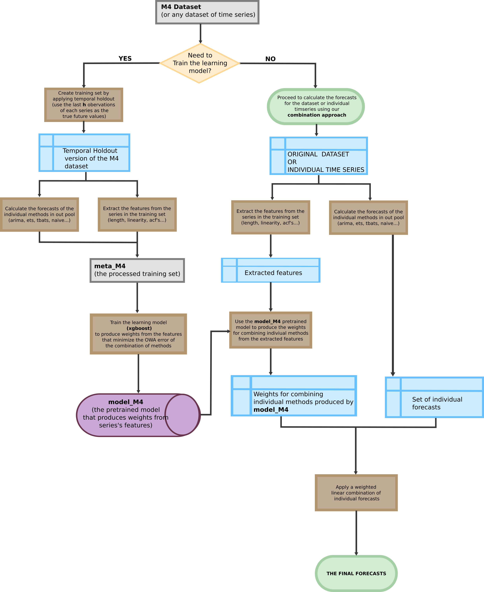

```{r setup, include = FALSE}
knitr::opts_chunk$set(
  collapse = TRUE, eval=TRUE,
  comment = "#>"
)
```
This page explains the methodoly behind the sumbission.
Is a part of the reproducibility submission.
The second part is the technical description and how to reproduce
the results. [The reproducibility part can be seen here](https://github.com/robjhyndman/M4metalearning/blob/master/docs/M4_reprod.md).


#Authorship

 * Pablo Montero-Manso
 * Thiyanga Talagala
 * Rob J Hyndman
 * George Athanasopoulos

#Overview

This approach can be described as a linear combination of statistical forecasting methods, where the weights of the combination are calculated by a learning model based on gradient tree boosting over a set of features extracted from the individual series.

A basic flowchart of the process is included to support the detailed description.

This methodological description page is divided in 3 sections, the Forecasting methods, where the individual forecasting methods are described, the Learning model, where the method for generating the weights is explained, for both Mean and Interval predictions, and the Features, where the features used in the learning model are described.


## Table of Contents
 * [The Forecasting Methods](#forecasting_methods)
 * [The Learning model](#learning_model)
 * [The Features](#features)
 
 
 
#Basic Flowchart


 
 
#<a name="forecasting_methods"></a>Forecasting methods

A set of 9 forecasting methods is used. These methods are fitted on each
individual series and produce the forecasts at the asked horizon. These forecasts are linearly combined to produce the final point forecast.
The rationale behind the pool of methods is to use easily available forecasting methods that can be fitted automatically. All the forecasting methods are well known forecasting methods, and are available in the `forecast` R package. For clarity, the specific R calls for fitting the models are given.

 1. **ARIMA** The ARIMA model. Parameters like the order of differencing,
 *p*, *q* are obtained through an exhaustive search.
   The code for fitting the model is `forecast::auto.arima(x, stepwise=FALSE, approximation=FALSE)`
 2. **ETS** Exponential smoothing state space model with parameters fitted automatically. The code for fitting the model is`forecast::ets(x)`
 3. **NNETAR** A feed-forward neural network with a single hidden layer is fitted to the lags. The number of lags is automatically selected.  The code for fitting the model is `forecast::nnetar(x)`
 
 4. **TBATS** The Exponential smoothing state space Trigonometric, Box-Cox transformation, ARMA errors, Trend and Seasonal components model. Parameters like the application of a Box-Cox transformation, to include trend, etc. are automatically fitted. The code for fitting the model is `forecast::tbats(x)`
 5. **STLM-AR** Seasonal and Trend decomposition using Loess with AR modeling of the seasonally adjusted series. The code for fitting the model is `forecast::stlm(x, modelfunction = stats::ar)`
 6. **RW-DRIFT** Random Walk with Drift. The code for fitting the model is `forecast::rwf(x, drift=TRUE)`
 7. **THETAF** The theta method of Assimakopoulos and Nikolopoulos (2000).
 The code for fitting the model is `forecast::thetaf(x)`
 8. **NAIVE** The naive method, using the last observation  of the series as the forecasts. The code for fitting the model is `forecast::naive(x)`
 9. **SEASONAL NAIVE** The forecast are the last observed value of the same season. The code for fitting the model is `forecast::snaive(x)`

In the case of an error when fitting the series (e.g. a series is constant), the SNAIVE forecast method is used instead.


#<a name="learning_model"></a>The Learning model

This section explains the learning model that produces the weights used to combine the individual forecast methods. We can distingush two methods:

1. **Model for producing the mean forecasts:** In essence, it is a feature-based gradient tree boosting approach where the loss or error function to minimize is tailored to the OWI error used in the M4 competition. The implementation of gradient tree boosting is `xgboost`, a tool that is computationally efficient and allows a high degree of customization. The set of features is explained in the [next section](#features).

2. **Model for producing the prediction intervals:** This method uses the mean forecasts (the result of our mean approach) as the center of the interval, and the finds a linear combination of the 95% prediction intervals of 3 forecasting methods in our original set, THETAF, NAIVE and SEASONAL NAIVE. One set of weights to combine this three intervals is produced per horizon, and is the same for all series, differing from the mean approach, where one set of weights is produced per series. The weights are calculated by minimizing the MSIS error of the linear combination of these three intervals in the training set.

## Creating the training set
 In order to train the learning model, a dataset where the OWI errors of the methods can be measured is required. In our case, we applied temporal holdout to the available M4 dataset to create this training set. The specific temporal holdout procedure is as follows:

 * For each series in M4, we know its values, $x$ and the required forecasting horizon, $h$
 * We take the last $h$ observations from $x$ and use them as the true future values, $xx$ of the remaining observations of $x$, $r$.
 * We add $r$ with its correspoding true future values $xx$ to the training set.
 * If $r$ has less than 7 observations, a smaller horizon is used.
 
In this new training set we can apply the forecasting methods and measure their OWI errors in a scenario that will be 'close' to the real one. We call this training set `meta_M4`

##Mean forecasts

Let $a$ be the features extracted from a time series $x$, $f$ the set of $M$ vectors with the forecasts for each method applied to $x$ and $xx$ the true future values of $x$. The gradient boosting method produces a vector of length $M$, real numbers, as a function of the features, $y(a)$.


We transform the output of the trees $y(a)$ from real numbers to probabilities by appling the $softmax$ transform. 
The error or 'loss' function for a series $x$ with features, $a$, forecasts set $f$ and the true future values $xx$ is:

$$ L_{OWA}(y,a,f,xx) = \sum_{i=1}^{M} \frac{e^{y(a)_i}}{\sum e^{y(a)}} OWA (f_i, xx) $$
This error function has three benefits:

1. It has interpretability as probabilities of the $i$-eth forecasting method being in our pool for the given features extracted from the series.
2. We are minimizing the OWI that the method chose as following the probabilities would make on average.
3. If we use the probabilities as weights in a linear combination of the forecasts, it is less prone to overfitting than a unrestricted linear combination, it can be though as a kind of regularization.

The gradient tree boosting approach implemented in `xgboost` works by additively approximating the function $y$ so that the overall error is minimized:

$$ argmin_y \sum_{j}^N L_{OWA}(y,A_j,F_j,XX_j) $$
where $A_j$, $F_j$, $XX_j$ are the features, forecasts and future values oth the $j$-eth series training set. The Gradient and Hessian of $L_{OWA}$ with respect to $y$ must be provided to `xbgoost` to proceed with the minimization. 

###Hyperparameter search

`xgboost` tree models have a range of hyperparameters that must be tuned to produce good results.

We have performed a search in a subset of the hyperparameter space by using Bayesian Optimization, measuring the OWA via a 10-fold crossvalidation of the training set `meta_M4`. The range of hyperparameters is as follows:

 * `max_depth` The maximum depth of a tree. From 6 to 14.
 * `eta` The learning rate, the scale of contribution of each tree. From 0.001 to 1.
 * `subsample` The proportion of the training set used to calculate the trees each iteration. From 0.5 to 1.
 * `colsample_bytree` The proportion of the features used to calculate the trees each iteration. From 0.5 to 1.
 * `nrounds` The number of iterations of the algorithm. From 1 to 250.
 
 The final set of hyperparameters was:
 `max_depth = 14`, `eta=0.58`, `subsample=0.92`, `colsample_bytree=0.77` and `nrounds = 94`. This set of features was not the best performing on the crossvalidation, but it produced very similar OWA error while being more regularized, less prone to overfitting.

###Producing the final combination forecast

The learning model, (that is the function $y$), is trained in `meta_M4`.

For a series $x$ in the **original** M4 dataset, the vector of features, $a$ is extracted from it and the individual methods' forecasts $f$ are calculated.
The model then produces its output $y(a)$ and it is transformed to probabilties. Finally the individual method's forecasts are combined by linear combination using these probabilities as 'weights' to produce the **final submitted forecast**.
  $$combi\_forecast(x) = \sum_{i}^{M} \frac{e^{y(a)_i}}{e^{y(a)}} f_i$$
*Note that we omit the forecasting horizon $h$ for simplicity. It would be an extra input parameter.*

## Prediction Intervals

The prediction intervals are also a linear combination of intervals of single methods. The weights of the combination are calculated the following way:

In the training set we calculate the 95% prediction intervals of the methods THETA, NAIVE and SEASONAL NAIVE, produced by their implementation in the `forecast` R package. This subset of methods was chose for comptutational cost reasons. For each of these methods, we get the 'radius' of the interval, the difference from the upper bound to the mean forecast (we consider symmetric intervals). These radiuses are also vectors of length $h$, the required forecasting horizon.
Using the mean forecast produced by our approach described in the previous section, the MSIS is minimized the following way:

A set of weights $w$ will be calculated per forecasting horizon.
For a given series $x$ we produce the mean combination forecast $c$, and the radius of the intervals of the $M=3$ methods, $r$.
*NOTE: This combination forecast $c$ used for training the interval is based on a model trained on a disjoint subset of the training set, to avoid overfitting, the final combination $c$ is based on all the training set.*
We start by calculaing the denomitator of the MSIS error formula, common to al horizons:
$$D = \sum_{t=1+m}^n x_t - x_{t-m} $$

Since we will calculate one set of weights per horizon, we will simplify the notation of the  MSIS formula and show the minimization of one specific horizon. This means that $w$ from now on are the set of $M=3$ weights for one specific horizon, eg. 13,  $xx$ would therefore be 13th true future value of $x$ in the training set.
The weights are calculated by minimizing the following formula:

$$ L(w,x) = \sum_{i=1}^{M}c - w_ir_i$$
$$U(w,x) = \sum_{i=1}^{M}c + w_ir_i$$


$$ MSIS(w,x,xx) = \frac{ 2 \sum_{1}^{M} r_iw_i + \frac{2}{\alpha}(L - xx)I(L<xx) + \frac{2}{\alpha}(xx - U)I(xx > U)}{D}$$

$$ argmin_w \sum_{j=1}^N MSIS(w, X_j, XX_j) $$
with $X$ and $XX$ the set of series and true future values in the training set `meta_M4` respectively.

This minimization is repeated for all forecasting horizons, 48 in the M4 competitions, to produce 48 sets of $M=3$ weights.
The optimization algorithm used is the standard Conjugate Gradient implemented in the `optim` R function.

### Computing the prediction intervals

For a given series $x$ we calculate the radius $r$ based on the three methods and the mean forecast $c$ of our mean approach. The precalculated set of weights $W$ is a $3 \times h$ matrix, just like $r$.

The prediction intervals for $x$ are:
$$U = c + diag(W'r)$$
and
$$L = c - diag(W'r)$$
With $W'$ denoting the transpose of $W$ and diag the diagonal elements of the matrix.

## Final postprocessing

A final step, common to both means and prediction interval forecasts, is setting negative values to 0. This is due to no obervations in the dataset being less than 0.

#<a name="features"></a> The Features

A set of 42 features is used in the metalearning model.
For each series the following 42 features are calculated.

 1. *x_acf* The first autocorrelation coefficient of the series.
 2. *x_acf10* The sum of the squared first ten autocorrelation coefficients of the series.
 3. *diff1_acf1* The first autocorrelation coefficient of the first differenced series
 4. *diff1_acf10* The sum of the squared first ten autocorrelation coefficients of the first differenced series.
 5. *diff2_acf1* The first autocorelation coefficient of the twice-differenced series.
 6. *diff2_acf10* The sum of squared fist ten autocorrelation coefficients of the original series.
 7. *seas_acf1* The autocorrelation coefficient at the first seasonal lag. If the series is non seasonal, this feature is set to 0.
 8. *ARCH.LM* A statistic based on the Lagrange Multiplier test of Engle (1982) for autoregressive conditional heteroscedasticity.The $R^2$ of an autoregressive model of 12 lags applied to $x^2$ after the its mean has been subtracted.
 9. *crossing_point* The number of times the time series crosses the median.
 10. *entropy* The spectral entropy of the series.
 $H_s(x_t) = - \int_{-\Pi}^{\Pi} f_x(\lambda) \log f_x(\lambda) d\lambda$ where the density is normalized so $\int_{-\pi}^{\pi} f_x(\lambda) d\lambda = 1$
 11. *flat_spots* The number of flat spots in the series, calculated by discretizing the series into 10 equal sized intervals and counting the maximung run length within any single interval.
 12. *arch_acf* After the series is pre-whitened using an AR model and squared, the sum of squares of the first 12 autocorrelations.
 13. *garch_acf* After the series is pre-whitened using an AR model, a GARCH(1,1) model is fitted to it and the residuals are calculated. The sum of squares of the first 12 autocorrelations of the squared residuals.
 14. *arch_r2* After the series is pre-whitened using an AR model and squared, the $R^2$ value of an AR model applied to it.
 15. *garch_r2* After the series is pre-whitened using an AR model, a GARCH(1,1) model is fitted to it and the residuals are calculated. The 
 sum of squares of the first 12 autocorrelations of the squared residuals.
 16. *alpha* $\alpha$ The smoothing parameter for the level in a ets(A,A,N) model fitted to the series.
 17. *beta* $\beta$ The smoothing parameter for the trend in a ets(A,A,N) model fitted to de series.
 18. *hurst* The hurst coefficient indicating the level of fractional differencing of a time series.
 19. *lumpiness* The variance of the variances based on a division of the series in non-overlapping portions. The size of the portions if the frequency of the series, or 10 is the series has frequency 1.
 20. *nonlinearity*  A nonlinearity statistic based on Terasvirta's nonlinearity test of a time series.
 21. *x_pacf5* The sum of squared first 5 partial autocorrelation coefficients of the series.
 22. *diff1x_pacf5* The sum of squared first 5 partial autocorrelation coefficients of the first differenced series.
 23. *diff2x_pacf5* The sum of squared first 5 partial autocorrelation coefficients of the twice differenced series.
 24. *seas_pacf* The partial autocorrelation coefficient at the first seasonal lag. 0 if the series is non seasonal.
 25. *nperiods* The number of seasonal periods in the series.
 26. *seasonal_period* The length of the seasonal period.
 27. *trend* In a STL decomposition of the series with $r_t$ the remainder series and $z_t$ the deseasonalized series: $max[0, 1- Var(r_t) / Var(z_t)]$
 28. *spike* In a STL decomposition of the series with $r_t$ the remainder series, the variance of the leave one out variances of $r_t$
 29. *linearity* In a STL decomposition of the series with $T_t$ the trend component, a quadratic model depending on time is fitted: $T_t = \beta_{0} + \beta_{1}t + \beta_{2}t^2 + \epsilon_t$. *linearity* is $\beta_{1}$.
 30. *curvature* In a STL decomposition of the series with $T_t$ the trend component, a quadratic model depending on time is fitted: $T_t = \beta_{0} + \beta_{1}t + \beta_{2}t^2 + \epsilon_t$. *curvature* is $\beta_{2}$.
 31. *e_acf1* The first autocorrelation coefficient of the remainder series in an STL decomposition of the series.
 32. *e_acf10* The sum of the first 10 squared autocorrelation coefficients of the remainder series in an STL decomposition of the series.
 33. *seasonal_strength* In a STL decomposition of the series with $r_t$ the remainder series and $x_t$ the detrended series: $max[0, 1- Var(r_t) / Var(x_t)]$.
 34. *peak* The location of the peak (maximum value) in the seasonal component of and STL decomposition of the series.
 35. *trough* The location of the trough (minimum value) in the seasonal component of and STL decomposition of the series.
 36. *stability* The variance of the means based on a division of the series in non-overlapping portions. The size of the portions is the frequency of the series, or 10 is the series has frequency 1.
 37. *hw_alpha* $\alpha$ parameter of an ets(A,A,A) model fitted on the series.
 38. *hw_beta* $\beta$ parameter of an ets(A,A,A) model fitted on the series.
 39. *hw_gamma* $\gamma$ parameter of an ets(A,A,A) model fitted on the series.
 40. *unitroot_kpss* The statistic for the Kwiatkowski et al. unit root test with linear trend and lag 1.
 41. *unitroot_pp* The statistic for the ''Z-alpha” version of Phillips & Perron unit root test with constant trend and lag 1.
 42. *series_length* The length of the series.


<!-- Vignettes are long form documentation commonly included in packages. Because they are part of the distribution of the package, they need to be as compact as possible. The `html_vignette` output type provides a custom style sheet (and tweaks some options) to ensure that the resulting html is as small as possible. The `html_vignette` format: -->

<!-- - Never uses retina figures -->
<!-- - Has a smaller default figure size -->
<!-- - Uses a custom CSS stylesheet instead of the default Twitter Bootstrap style -->

<!-- ## Vignette Info -->

<!-- Note the various macros within the `vignette` section of the metadata block above. These are required in order to instruct R how to build the vignette. Note that you should change the `title` field and the `\VignetteIndexEntry` to match the title of your vignette. -->

<!-- ## Styles -->

<!-- The `html_vignette` template includes a basic CSS theme. To override this theme you can specify your own CSS in the document metadata as follows: -->

<!--     output:  -->
<!--       rmarkdown::html_vignette: -->
<!--         css: mystyles.css -->

<!-- ## Figures -->

<!-- The figure sizes have been customised so that you can easily put two images side-by-side.  -->

<!-- ```{r, fig.show='hold'} -->
<!-- plot(1:10) -->
<!-- plot(10:1) -->
<!-- ``` -->

<!-- You can enable figure captions by `fig_caption: yes` in YAML: -->

<!--     output: -->
<!--       rmarkdown::html_vignette: -->
<!--         fig_caption: yes -->

<!-- Then you can use the chunk option `fig.cap = "Your figure caption."` in **knitr**. -->

<!-- ## More Examples -->

<!-- You can write math expressions, e.g. $Y = X\beta + \epsilon$, footnotes^[A footnote here.], and tables, e.g. using `knitr::kable()`. -->

<!-- ```{r, echo=FALSE, results='asis'} -->
<!-- knitr::kable(head(mtcars, 10)) -->
<!-- ``` -->

<!-- Also a quote using `>`: -->

<!-- > "He who gives up [code] safety for [code] speed deserves neither." -->
<!-- ([via](https://twitter.com/hadleywickham/status/504368538874703872)) -->
